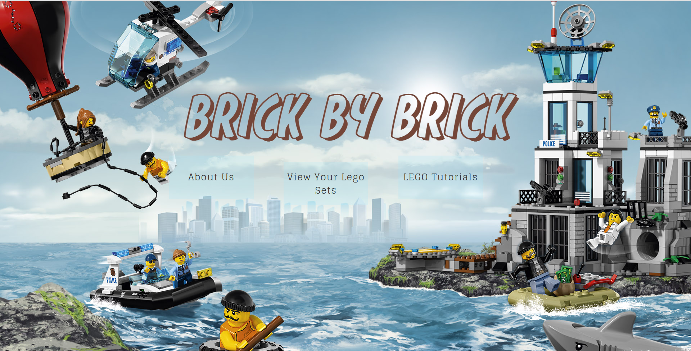
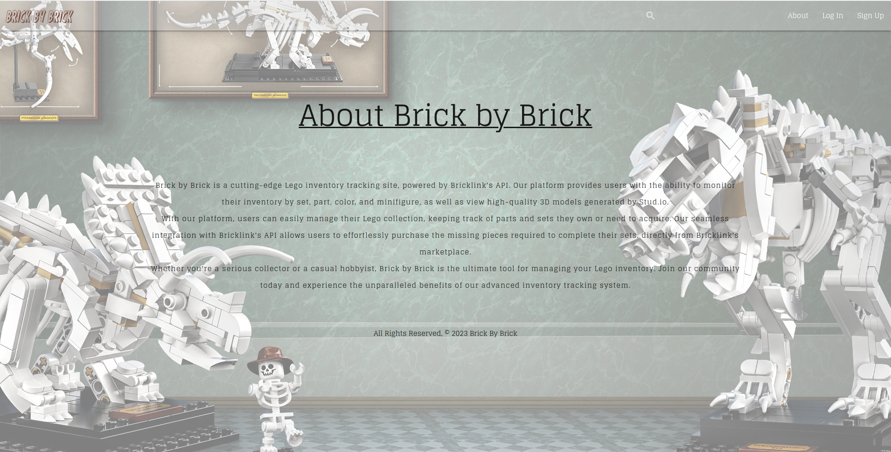
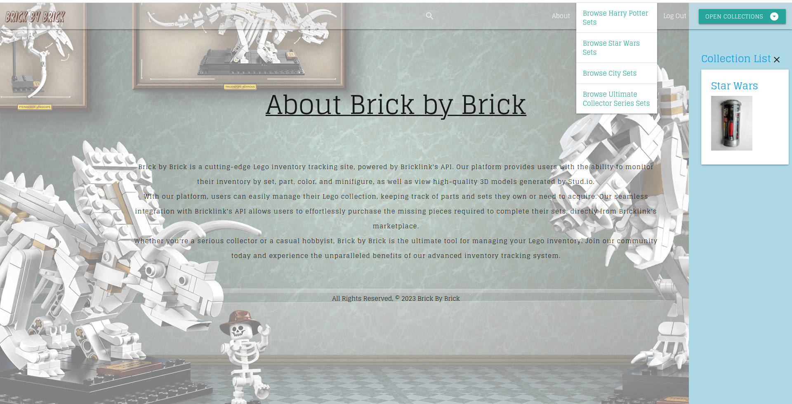
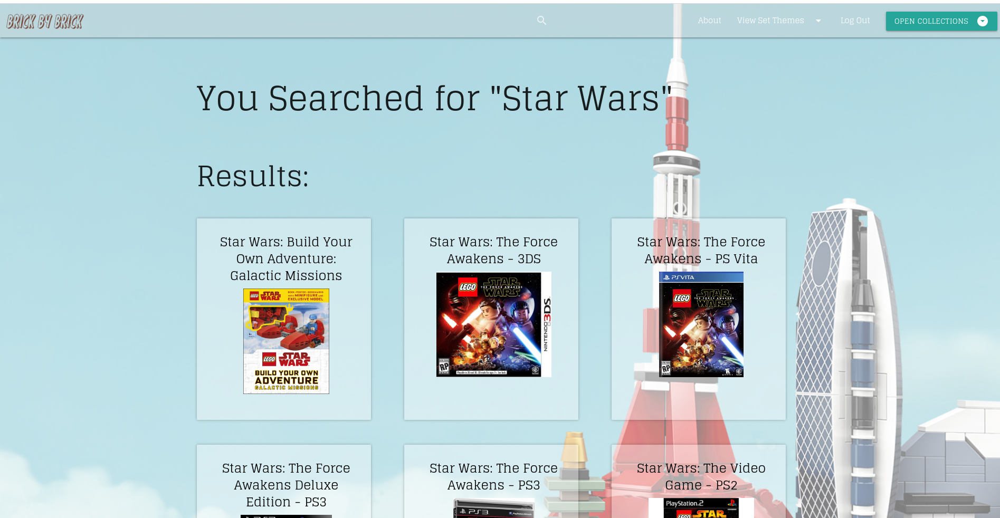

# Brick by Brick

## By: Gary Zhuo, Jim Creel, and Nicolas Angel

<p align="center"></p>

### Link to Brick by Brick

---

Click Here!

### Project Description

---

Many existing Lego websites lack user-centered design and appeal to resellers, leading to a less engaging user experience and a site promoting the price gouging of Lego sets. Brick by Brick is focused on giving an eye appealing and user-friendly approach to browsing Lego sets. Powered by BrickLinks API, Brick by Brick is able to cross compare sets that you own to sets you would like to build by every individual part!

Brick by Brick Values

* Sustainability:
  * Cut down the need for new Lego sets by recycling the users existing Lego parts to use for new builds.
* Cost-Effective:
  * Reduces the users need to purchase new sets at high reseller prices and focus on saving money.
* Convenience:
  * Brick by Brick was made to be user friendly compared to other competitors websites. Our main mission was to save the users time searching for sets and individual parts they come with.
* Community:
  * Built by Lego fans, Brick by Brick is dedicated to foster a sense of community by allowing users to browse the many options on new sets they can build and share them with the world!

### Getting Started

---

Brick by Brick used these resources to plan out the website and how it was built.

Feel free to browse the links below!

* [Trello Board](https://trello.com/b/LbKtyQYe/brick-by-brick-unit-3-project)
* [Pitch Deck](https://docs.google.com/presentation/d/13AaIUvx5hBIPDS11o4axd45i4k2cGlKIWQkJf3aqpf4/edit#slide=id.g2264f569ebc_0_1219)

### Installation Instructions

---

* Fork and Clone this Repo.
* Use :
  ```
  git clone <paste clone link here>
  ```
* Once files are installed, download any dependencies needed!

### How to browse "Brick by Brick"

---

* Below is Brick by Bricks Landing Page:

<p align="center"></p>

* Next browse to the About Us page:

<p align="center"></p>

* After Login, Feel free to browse preselected sets, add to personal collections!

<p align="center"></p>

* Or feel free to search your own sets!

<p align="center"></p>

* DISCLAIMER: Brick by Brick is in constant production, the website might change and slighly differ from these images! The devs will update as soon as we can!

### Technology Used

---

Technologies Used for Brick by Brick:

* Django
* Python 3
* Javascript
* HTML 5
* CSS
* Materialize CSS
* GitHub
* Heroku
* PostgreSQL

### Next Steps

---

* Brick by Brick has some bright ideas for our future...
  * Implementing a 3-D model API for each set in our database

### Credits

---

**Gary Zhou**

* Roles:
  * Scrum Master
  * Designer
* Links:

<p align="left">
	<a target="_blank" rel="noopener noreferrer" href="https://github.com/garyzhuo"></a> 
	<a target="_blank" rel="noopener noreferrer" href="https://www.linkedin.com/in/garyzhuo/"></a> 
	<a target="_blank" rel="noopener noreferrer" href="http://www.garyzhuo.com/"></a> 
</p>

**Jim Creel**

* Roles:
  * GitHub Manager
  * Database Manager
* Links:

<p align="left">
	<a target="_blank" rel="noopener noreferrer" href="https://github.com/jimcreel"></a> 
	<a target="_blank" rel="noopener noreferrer" href="https://www.linkedin.com/in/jim-creel/"></a> 
	<a href=""></a> 
</p>

**Nicolas Angel**

* Roles:

  * Database Manager
  * Documenter
* Links:

  <p align="left">
  	<a target="_blank" rel="noopener noreferrer" href="https://github.com/nangel42"></a> 
  	<a target="_blank" rel="noopener noreferrer" href="https://www.linkedin.com/in/nicolasangel/"></a> 
  	<a target="_blank" rel="noopener noreferrer" href="https://nangel42.github.io/Nicolas-Angel-Portfolio/"></a> 
  </p>
