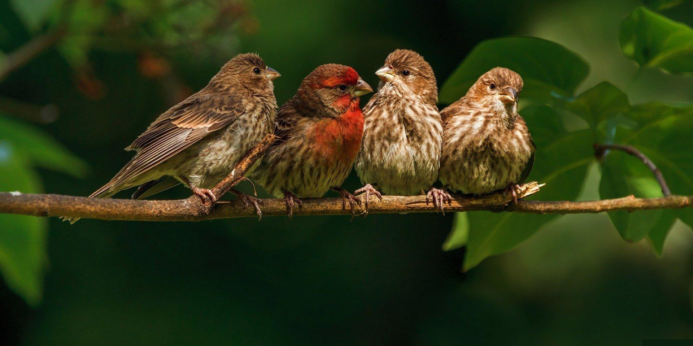

# Finch Collector
<p align="center"></p>


## Intro
In class we will be building a `catcollector` project and modeling what we do each day in the `finchcollector` project! Do each part (1 through 5) and don't fall behind, since your future deliverables depend on the previous parts!

You will be given class time to work on the deliverables :)

**NOTE:** you can choose a different animal rather than finches if you prefer!

## Submission Instructions
- Fork and clone this repository
- In the repository folder on your computer, create a folder called `finchcollector`.
- Scaffold a Django app inside the `finchcollector` folder. You'll be working in this folder for each of the five parts.
- Commit early and commit often
- When you have finished a part create a commit message like this:
    ```
    Part 1 complete - ready to be graded
    ```
- We will be grading each part as it's own deliverable! Make sure you complete each part before moving on to the next


## General Requirements (applicable to all parts)
- Ensure each page of your website is reponsive to the screen it is displayed on.
- Observe a consistent separation of concerns.
- Maintain consistent CSS styling throughout the site (using a CSS framework may be beneficial for this).
- Provide a link to any resources from which you obtained code, and be able to explain the purpose of all the code within your application.


## Part 1
Today in the **Django URLs, Views, and Templates** lesson, you created a minimal but functional application that renders an index page that dynamically displays a hardcoded list of Cat objects.

In this lab, you'll do the same, except you'll create and use a data resource of your choosing.

<details>
<summary><strong>Django project setup steps</strong></summary>

**1. Create the database**
```
createdb finchcollector
```

**2. Start the project**
```
django-admin startproject finchcollector
```

**3. Change into the finchcollector directory and open the project in VScode**
```
cd finchcollector
code .
```

**4. Create the app**
```
python3 manage.py startapp main_app
```
> Note: You'll now find a **main_app** folder within the top-level project folder.

**5. Add main_app to the list of INSTALLED_APPS in `settings.py`:**
```python
INSTALLED_APPS = [
	'main_app',
	'django.contrib.admin',
	'django.contrib.auth',
	'django.contrib.contenttypes',
	'django.contrib.sessions',
	'django.contrib.messages',
	'django.contrib.staticfiles',
]
```

**6. Check that your project starts up**
```
python3 manage.py runserver
```

**7. Connecting to the Database**

Earlier we created a dedicated `finchcollector` PostgreSQL database.

A Django project's configuration lives in **settings.py**. Let's update it to use our `finchcollector` database:

```python
DATABASES = {
    'default': {
        'ENGINE': 'django.db.backends.postgresql',
        'NAME': 'finchcollector',
    }
}
```

**8. Apply the pending migrations**
```
python3 manage.py migrate
```

**You should now be setup and ready to go!**
</details>


### Requirements
Following the steps we took in the **Django URLs, Views, and Templates lesson**, complete the following exercises:

1. Simulate finch data using a list of finch dictionaries in **views.py**.
2. Implement the following User Stories:
	- As a user (AAU), I want to be able to navigate to separate pages for `About` and `All Finches` using a navbar
	- AAU, when I visit the `About` page, I want to view some details about the finchcollector application.
	- AAU, when I visit the `All Finches` page, I want to view a list of all finches (index view) that displays each of the attributes of a finch.


### Bonus
1. Customize your application using CSS, or even a third party CSS library! Here are a few links to some great ones below:
	- [Materialize CSS](https://materializecss.com/getting-started.html)
	- [Bootstrap](https://getbootstrap.com/docs/5.3/getting-started/introduction/)
	- [Foundation](https://get.foundation/sites/docs/installation.html)
	- [Bulma](https://bulma.io/documentation/overview/start/)