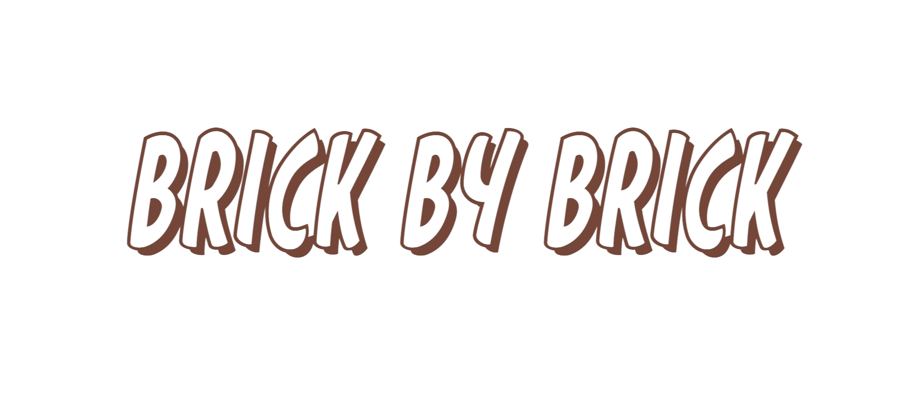

# Brick by Brick

## By: Gary Zhuo, Jim Creel, and Nicolas Angel

### Project Description

---

    Many existing lego websites lack user-centered design and appeal to resellers, leading to a less engaging user experience and a site promoting the price gouging of lego sets. Brick by Brick is focused on giving an eye appealing and user-friendly approuch to browing lego sets. Powered by BrickLinks API, Brick by Brick is able to cross compare sets that you own to sets you would like to build by every individual part!

This reduces the users need to purchase new sets at high reseller prices and focus on saving money and recycling lego parts!

Brick

### Installation Instructions

---

### How to browse "Brick by Brick"

---

### Credits

---
